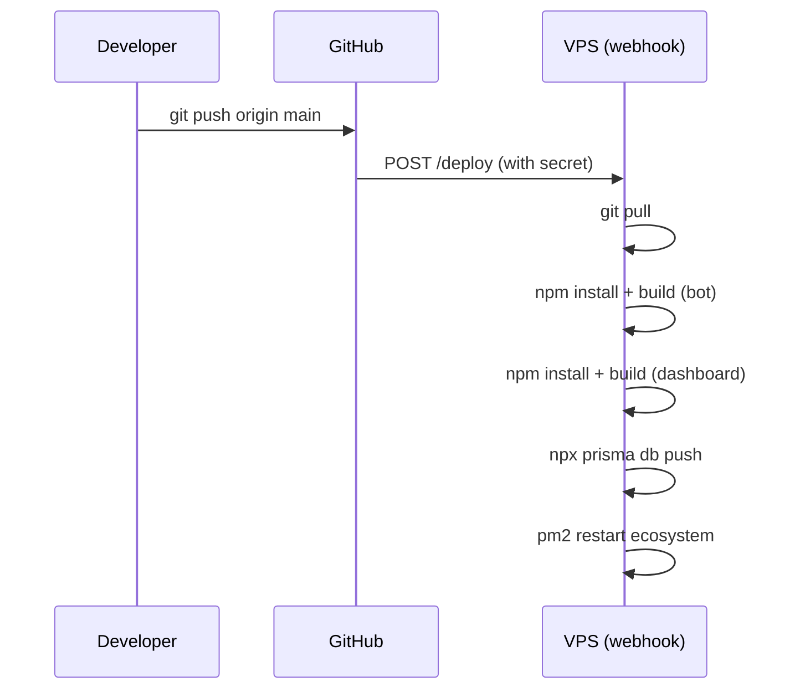
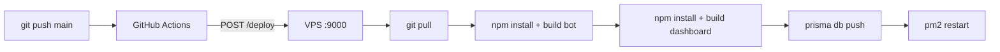

As developers, we spend about 90% of our time in a safe space called **Localhost**. It's cozy there. Errors are visible, ports are open, and if things catch fire, we just hit `ctrl+c` and pretend nothing happened.

But when I built **Fortuna**, a complex Discord economy ecosystem with a full dashboard, I knew localhost wasn't going to cut it. I needed a real production environment. Instead of choosing a "magic" managed platform (like Vercel or Heroku) that hides all the messy bits, I chose the hard road: **A self-managed Linux VPS.**

Why? Because I apparently like pain. And also because understanding how your code runs on a bare-metal server is just as important as writing the code itself.

Here is a technical breakdown of my journey deploying a full-stack app without the training wheels.

---

## 1. The Foundation: The Linux VPS

A Virtual Private Server (VPS) is basically a slice of a supercomputer that you rent. Unlike managed hosting, you start with absolutely nothing but an Operating System (usually Ubuntu) and a blinking cursor.

### The Challenge: Where is my Mouse?

When you first log into a VPS via SSH (Secure Shell), you realize there is no GUI. No windows, no "File Explorer," just a black screen judging you.

**The Learning:** I had to get comfortable with the Command Line Interface (CLI) fast. I wasn't clicking-and-dragging; I was `mv`-ing and `chmod`-ing.

**Security:** The first step wasn't deploying code; it was locking the door. I disabled password logins (because brute-force attacks are real) and set up SSH Keys. Then I configured the Firewall (`ufw`) to block every port except the ones I actually needed (22, 80, 443).

---

## 2. The Runtime: Why `node index.js` is a Lie

In development, you run `npm run dev` and leave your terminal open. If you close your laptop, the app dies. In production, your app needs to run 24/7, even when you're sleeping.

### Enter PM2 (The Babysitter)

PM2 is a process manager for Node.js. Think of it as a hyper-vigilant babysitter for your code.

**Why I used it:**

- **Daemonization:** It runs the app in the background so I can safely disconnect SSH without killing the server.
- **Auto-Restart:** If my code crashes (and let's be real, it happens), PM2 picks it up, dusts it off, and restarts it instantly.
- **Startup Hooks:** I told PM2 to launch automatically if the server reboots. Because servers *do* reboot.

---

## 3. The Gatekeeper: Nginx & Reverse Proxying

My Next.js app runs on port 3000. But web browsers look for port 80 (HTTP) or 443 (HTTPS). I couldn't exactly ask users to type `fortunabot.dev:3000` unless I wanted zero users.

I needed a **Reverse Proxy**.

### What is Nginx?

Nginx is a high-performance web server. In my setup, it sits in front of the Node.js application like a bouncer.

### How it works:

1. **Traffic Entry:** A user visits `fortunabot.dev`. The request hits the server on standard port 443.
2. **The Handover:** Nginx accepts the request and "proxies" (passes) it internally to `localhost:3000`.
3. **Response:** The Node app sends the page back to Nginx, which serves it to the user.

### Why add the extra step?

- **SSL Termination:** Nginx handles the fancy HTTPS encryption certificates (thanks, Let's Encrypt), so my Node app doesn't have to worry about security handshakes.
- **Security:** It hides my internal network structure from the public internet.

---

## 4. The "Fun" Part (Errors)

Deploying wasn't a straight line. It was a zig-zag of errors and Google searches.

### The "502 Bad Gateway"

- **The Issue:** Nginx was running, but it gave me a 502 error.
- **The Fix:** I realized my Next.js app was listening on IPv6 localhost (`::1`) while Nginx was shouting at IPv4 (`127.0.0.1`). Explicitly setting the host resolved the communication breakdown.

### Database Latency

- **The Issue:** Everything felt sluggish.
- **The Fix:** I implemented Redis caches. Instead of pestering the database for every single user command, I cached frequent data (like balances). Response times dropped from ~200ms to ~20ms.

---

## 5. The Pipeline: CI/CD with GitHub Actions & Webhooks

Remember in the intro where I said I liked pain? Well, pulling code manually via SSH every single time I fixed a typo was the kind of pain even I couldn't romanticize. It was time to automate.

### The Problem: Deploying Like a Caveman

My old deploy workflow looked like this:

1. Finish coding on my local machine.
2. `git push origin main`
3. SSH into the VPS.
4. `cd /root/app && git pull origin main`
5. `npm install && npm run build`
6. `cd dashboard && npm install && npm run build`
7. `npx prisma db push`
8. `pm2 restart ecosystem.config.js`

That's **8 manual steps**. Every. Single. Time. At 3 AM when you're fixing a critical bug, you *will* forget step 6, and your dashboard will serve stale code for 4 hours before you notice. Ask me how I know.

I needed a **CI/CD Pipeline** — Continuous Integration / Continuous Deployment. The idea is simple: push code to GitHub, and the rest happens automatically. No SSH. No manual commands. Just `git push` and go to sleep.

### The Architecture: How It All Connects

Here's the high-level flow of the pipeline I built:



Let me break down every single piece.

---

### 5.1 GitHub Actions: The Trigger

GitHub Actions is GitHub's built-in CI/CD platform. It lets you define "workflows" — automated tasks that run in response to events like pushes, pull requests, or schedules.

My workflow is intentionally minimal. I didn't want GitHub's runners doing heavy lifting (building, testing, deploying) because:

1. **Runner minutes cost money** at scale.
2. My VPS already has the full environment (Node.js, PM2, Prisma, the `.env` file). Why replicate all that in a CI runner?
3. I wanted the deploy to be fast — no waiting for a runner to spin up, install dependencies, build, and then `scp` files to my server.

Instead, the GitHub Actions workflow does **one thing**: it sends an HTTP POST request to my VPS. That's it. One `curl` command. The entire workflow takes about 2-3 seconds of runner time.

#### The Workflow File: `.github/workflows/deploy.yml`

```yaml
name: Deploy to VPS

on:
  push:
    branches: [main]

jobs:
  deploy:
    runs-on: ubuntu-latest
    steps:
      - name: Trigger VPS Deploy Webhook
        run: |
          curl -s -o /dev/null -w "%{http_code}" \
            -X POST "$DEPLOY_WEBHOOK_URL" \
            -H "Content-Type: application/json" \
            -H "X-Deploy-Secret: $DEPLOY_SECRET" \
            -d '{"ref": "$GITHUB_REF", "sha": "$GITHUB_SHA"}'
```

> **Note:** In the actual file, the environment variables above use GitHub's `secrets` context syntax to inject values from GitHub Secrets securely at runtime. I've simplified them here for readability.

**Breaking this down line by line:**

| Line | What It Does |
|------|-------------|
| `on: push: branches: [main]` | Only triggers when code is pushed to the `main` branch. Feature branches are ignored. |
| `runs-on: ubuntu-latest` | Uses GitHub's free Ubuntu runner. |
| `curl -s -o /dev/null -w "%{http_code}"` | Sends a silent HTTP request and prints only the status code (200, 403, etc). |
| `-X POST "$DEPLOY_WEBHOOK_URL"` | Posts to the VPS webhook URL, stored securely in GitHub Secrets. |
| `-H "X-Deploy-Secret: ..."` | Sends a secret token in the header for authentication. |
| `-d '{...}'` | Sends metadata about the commit (branch, SHA, commit message) in the request body. |

**GitHub Secrets used:**

| Secret | Example Value | Purpose |
|--------|--------------|---------|
| `DEPLOY_WEBHOOK_URL` | `http://<VPS_IP>:9000/deploy` | The URL of the webhook listener on the VPS |
| `DEPLOY_SECRET` | A random 64-character hex string | Shared secret for authentication |

You set these in **GitHub → Repository → Settings → Secrets and variables → Actions**.

> **Why not use GitHub's built-in deployment features?** Because they're designed for managed platforms. My VPS is a raw server. The webhook approach gives me full control over *what* happens on deploy, and I can customize the pipeline without being locked into GitHub's Action marketplace.

---

### 5.2 The Webhook Listener: `socat` on the VPS

Now, the VPS needs something to *catch* that HTTP POST from GitHub Actions. I needed a lightweight HTTP listener.

I didn't want to install a full web framework (Express, Flask) just to listen for one POST request. That's overkill. Instead, I used **`socat`** — a command-line utility that can create network connections, including simple TCP listeners.

#### What is socat?

`socat` (SOcket CAT) is like the Swiss Army knife of networking. It can:

- Relay data between two data channels (files, pipes, devices, sockets).
- Act as a minimal TCP server.
- Forward ports, create tunnels, and more.

For my use case, it listens on port 9000 and, for every incoming connection, executes a bash script that reads the HTTP request, validates the secret, and runs the deploy.

#### Installing socat:

```bash
apt install -y socat
```

#### The Webhook Script: `deploy/deploy-webhook.sh`

This is the heart of the pipeline. It's a bash script that does double duty — it acts as both the HTTP server and the deploy runner.

```bash
#!/bin/bash
# Casino- Deploy Webhook Listener
# Listens on port 9000 for POST requests from GitHub Actions
# Requirements: socat, git, node, npm, pm2

set -uo pipefail

PORT="${DEPLOY_PORT:-9000}"
APP_DIR="${APP_DIR:-/root/app}"
LOG_FILE="${LOG_FILE:-/var/log/casino-deploy.log}"
DEPLOY_SECRET="${DEPLOY_SECRET:?DEPLOY_SECRET environment variable is required}"
```

**The configuration variables:**

| Variable | Default | Purpose |
|----------|---------|---------|
| `DEPLOY_PORT` | `9000` | Port the webhook listener runs on |
| `APP_DIR` | `/root/app` | Path to the cloned repository on the VPS |
| `LOG_FILE` | `/var/log/casino-deploy.log` | Where all deploy output is logged |
| `DEPLOY_SECRET` | *(required)* | Must match the secret sent by GitHub Actions |

#### How the HTTP Handling Works

When a request comes in, the script reads it line by line:

```bash
handle_request() {
    local content_length=0
    local secret=""
    local body=""

    # Read the HTTP request line (e.g., "POST /deploy HTTP/1.1")
    read -r line

    # Read headers one by one
    while read -r line; do
        line="${line%%$'\r'}"
        [ -z "$line" ] && break

        # Extract Content-Length header
        if [[ "$line" =~ ^[Cc]ontent-[Ll]ength:\ *([0-9]+) ]]; then
            content_length="${BASH_REMATCH[1]}"
        fi

        # Extract our custom secret header
        if [[ "$line" =~ ^[Xx]-[Dd]eploy-[Ss]ecret:\ *(.*) ]]; then
            secret="${BASH_REMATCH[1]}"
        fi
    done

    # Read body if present
    if [ "$content_length" -gt 0 ]; then
        read -rN "$content_length" body
    fi

    # VALIDATE: reject if secret doesn't match
    if [ "$secret" != "$DEPLOY_SECRET" ]; then
        echo -ne "HTTP/1.1 403 Forbidden\r\nContent-Length: 12\r\n\r\nUnauthorized"
        return
    fi

    # Respond immediately with 200 OK, then deploy in background
    echo -ne "HTTP/1.1 200 OK\r\nContent-Length: 15\r\n\r\nDeploy started!"
    do_deploy &
}
```

The key insight here: the script responds with `200 OK` **immediately**, then kicks off the deploy in the background (notice the `&`). This is important because GitHub Actions has a timeout — if the deploy took 5 minutes and we waited for it to finish before responding, the `curl` request would time out and GitHub would mark the workflow as failed, even though the deploy was still running fine.

#### The Deploy Pipeline

Once authenticated, the `do_deploy` function runs every step:

```bash
do_deploy() {
    cd "$APP_DIR" || { log "Failed to cd to $APP_DIR"; return 1; }

    # Step 1: Pull latest code from GitHub
    log "Pulling latest code..."
    git pull origin main

    # Step 2: Install bot dependencies and build
    log "Installing bot dependencies..."
    npm install

    log "Building bot..."
    npm run build

    # Step 3: Sync database schema (Prisma)
    log "Running Prisma db push..."
    npx prisma db push --accept-data-loss

    # Step 4: Install dashboard dependencies and build
    log "Installing dashboard dependencies..."
    cd dashboard
    npm install

    log "Building dashboard..."
    npm run build
    cd ..

    # Step 5: Restart all PM2 processes
    log "Restarting PM2 processes..."
    pm2 restart ecosystem.config.js
    pm2 save

    log "Deploy complete!"
}
```

Every line of output is tee'd to `/var/log/casino-deploy.log` so I can review deploys later:

```bash
tail -f /var/log/casino-deploy.log
```

#### The Entrypoint: socat Meets Bash

The script cleverly acts as both the listener *and* the handler using a `--handle` flag:

```bash
if [ "${1:-}" = "--handle" ]; then
    handle_request        # Process incoming HTTP request
else
    # Start socat listener — for every connection, fork
    # and re-run this script with --handle
    socat TCP-LISTEN:"$PORT",reuseaddr,fork \
          EXEC:"$SCRIPT_PATH --handle"
fi
```

When you run `./deploy-webhook.sh` directly, it starts `socat` listening on port 9000. For every incoming TCP connection, `socat` forks a new process and executes the same script with `--handle`, which then reads the HTTP request and processes it. It's a self-contained HTTP server in pure bash.

---

### 5.3 Systemd: Keeping the Listener Alive

The webhook listener needs to run 24/7, survive reboots, and restart if it crashes. Sound familiar? That's exactly what PM2 does for Node.js apps. For system-level services on Linux, we use **systemd**.

#### The Service File: `deploy/deploy-webhook.service`

```ini
[Unit]
Description=Casino Deploy Webhook Listener
After=network.target

[Service]
Type=simple
User=root
WorkingDirectory=/root/app
ExecStart=/root/app/deploy/deploy-webhook.sh
Restart=always
RestartSec=5

# Environment — set your secret here
Environment=DEPLOY_SECRET=CHANGE_ME_TO_A_STRONG_SECRET
Environment=DEPLOY_PORT=9000
Environment=APP_DIR=/root/app
Environment=LOG_FILE=/var/log/casino-deploy.log

# Load .env for Node/Prisma commands during deploy
EnvironmentFile=-/root/app/.env

[Install]
WantedBy=multi-user.target
```

**What each directive does:**

| Directive | Purpose |
|-----------|---------|
| `After=network.target` | Only start after the network is up (otherwise `socat` can't bind to a port) |
| `Restart=always` | If the script crashes, systemd restarts it automatically |
| `RestartSec=5` | Wait 5 seconds between restarts (prevents crash loops from hammering the CPU) |
| `Environment=DEPLOY_SECRET=...` | Injects the secret as an environment variable |
| `EnvironmentFile=-/root/app/.env` | Loads the project's `.env` file so Prisma and Node have database URLs, API keys, etc. The `-` prefix means "don't fail if the file doesn't exist" |

#### The Commands to Set It Up

```bash
# Generate a strong random secret
openssl rand -hex 32

# Make the webhook script executable
chmod +x /root/app/deploy/deploy-webhook.sh

# Edit the service file — replace CHANGE_ME_TO_A_STRONG_SECRET with your generated secret
nano /root/app/deploy/deploy-webhook.service

# Copy the service file to systemd's directory
cp /root/app/deploy/deploy-webhook.service /etc/systemd/system/

# Tell systemd to reload its configuration
systemctl daemon-reload

# Enable the service (starts on boot)
systemctl enable deploy-webhook

# Start the service now
systemctl start deploy-webhook

# Verify it's running
systemctl status deploy-webhook
```

Don't forget to open the webhook port on the firewall:

```bash
ufw allow 9000/tcp
```

---

### 5.4 The Full Picture: End-to-End Flow

Let me trace a complete deploy from keystroke to production:



**Step by step:**

| Step | What Happens | Where |
|------|-------------|-------|
| 1 | `git commit && git push origin main` | Developer's machine |
| 2 | Workflow triggers on push to `main` | GitHub Actions |
| 3 | `curl -X POST` to VPS with secret header | GitHub Runner |
| 4 | `socat` receives POST on port 9000 | VPS |
| 5 | Script validates `X-Deploy-Secret` header | VPS |
| 6 | `git pull origin main` | VPS |
| 7 | `npm install && npm run build` (bot) | VPS |
| 8 | `npx prisma db push` (sync database schema) | VPS |
| 9 | `cd dashboard && npm install && npm run build` | VPS |
| 10 | `pm2 restart ecosystem.config.js` | VPS |
| 11 | `pm2 save` (persist process list) | VPS |

**Total time from push to production:** ~2-4 minutes (mostly spent on `npm run build`).

**Total human effort:** Zero. Just `git push`.

---

### 5.5 Security Considerations

Exposing a webhook endpoint on your VPS means the entire internet can *try* to hit it. Here's how I locked it down:

1. **Shared Secret Authentication:** Every request must include the correct `X-Deploy-Secret` header. Without it, the listener responds with `403 Forbidden` and does nothing. The secret is a 64-character random hex string generated by `openssl rand -hex 32`.

2. **Firewall Rules:** Port 9000 is open via `ufw`, but only for TCP traffic. Combined with the secret validation, random port scans won't trigger deploys.

3. **No Code in Transit:** The webhook doesn't receive any code. It just receives a "hey, deploy now" signal. The actual code is pulled directly from GitHub over HTTPS via `git pull`.

4. **Logging:** Every deploy attempt (successful or unauthorized) is logged to `/var/log/casino-deploy.log` with timestamps, so I have a full audit trail.

---

### 5.6 The Tech Stack Summary

Here's every tool involved in the CI/CD pipeline:

| Technology | Role | Why This Tool? |
|-----------|------|---------------|
| **GitHub Actions** | Workflow trigger | Free for public repos, native GitHub integration, runs on push |
| **curl** | HTTP client (in the workflow) | Built into every Linux system, simple one-liner |
| **socat** | TCP/HTTP listener on VPS | Lightweight (~100KB binary), no runtime, no dependencies |
| **Bash** | Deploy script language | Available on every Linux server, no installation needed |
| **systemd** | Service manager | Built into Ubuntu, handles auto-start and crash recovery |
| **Git** | Code synchronization | `git pull` is the simplest way to sync code between GitHub and VPS |
| **npm** | Package management & builds | Standard Node.js toolchain |
| **Prisma** | Database schema sync | `prisma db push` ensures schema changes are applied automatically |
| **PM2** | Process management | Restarts bot + dashboard gracefully after each build |
| **ufw** | Firewall | Simple firewall rule to expose the webhook port |

---

## 6. Scope for Improvement

I survived, but engineering is never "done."

- ~~**CI/CD Pipeline:** Right now, I'm manually pulling code from GitHub like a caveman. Automated pipelines (GitHub Actions) are next on the list.~~ ✅ **Done!** See Section 5 above.

- **Docker:** Managing dependencies on the OS level is messy. Dockerizing the app would effectively solve the "but it works on my machine" problem forever.

- **Zero-downtime deploys:** Currently, `pm2 restart` causes a brief moment where the app is unavailable. Implementing PM2's `reload` (graceful restart) or blue-green deployments would eliminate even that tiny window.

- **Rollback Strategy:** If a deploy breaks production, I currently have to manually SSH in and `git revert`. An automated rollback on build failure would be the next level.

---

## Conclusion

Building Fortuna taught me that writing code is only half the battle. Delivering that code to users requires a solid understanding of infrastructure.

Mastering tools like **Linux**, **PM2**, **Nginx**, and now **CI/CD pipelines** bridges the gap between a "project" and a "product." The result is a system that is robust, fast, fully automated, and completely under my control.

The localhost comfort zone is nice. But there's nothing quite like the feeling of pushing code and watching it go live on its own — without touching a single server.