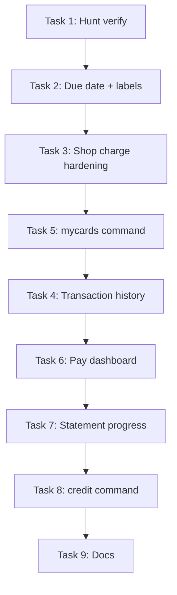

# Credit Card System + Hunt Consumables Implementation Plan

> **For agentic workers:** REQUIRED SUB-SKILL: Use superpowers:subagent-driven-development (recommended) or superpowers:executing-plans to implement this plan task-by-task. Steps use checkbox (`- [ ]`) syntax for tracking.

**Goal:** Make Fortuna credit cards fully functional for shop purchases (balance moves toward limit, due dates visible), add a dedicated `!mycards` dashboard with easy pay flows, and verify hunt consumable item effects are wired end-to-end.

**Architecture:** Fix the credit lifecycle at the service layer first (`creditCardService.ts` — charge, due dates, projected minimums), then improve UX surfaces (`bank.ts`, `card.ts`, `bankInteractionHandler.ts`, `commandRouter.ts`, `shop.ts`). Hunt consumables already set Redis buffs in `shopItemEffects.ts` and consume them in `huntService.ts`; this plan adds verification and edge-case hardening only.

**Tech Stack:** TypeScript, Discord.js Components V2, Prisma (Mongo), Redis (hunt buffs), existing `creditCardService` / `shopService` transaction pattern.

---

## Current State (Audit)

### Hunt consumables — mostly done, needs verification

| Item | Handler | Hunt logic |
|------|---------|------------|
| Camouflage Kit | `shopItemEffects.ts` → Redis `hunt_camouflage:*` | +10% Rare, +5% Legendary weights |
| Bait Box | `shopItemEffects.ts` → Redis `hunt_bait_box:*` | Forces ≥2 animal rolls |
| Echo Whistle | `shopItemEffects.ts` → Redis `hunt_echo_whistle:*` | 35% echo of best catch |

Shop/inventory use path: `handleSpecialItemUse()` → if `null`, error *"This item has no special effect."*

### Credit card — backend exists, UX and lifecycle gaps

**What works today:**
- `chargeCardPurchaseTx()` in `shopService.ts` increments `currentBalance` + `spentThisCycle` inside the shop transaction.
- Weekly scheduler runs `processWeeklyCardSettlement()` (statements + delinquency).
- `!bank` → Cards → **My Cards** shows balance, limit, statement fields.
- `!card pay <amount>` text command works via `payCard()`.

**Reported bug — “balance stuck, not moving toward limit”:**

Likely causes (check in order):

1. **Tester bypass** — `isTester()` in `shopService.ts` skips all payment including card charges. Test accounts in `developerAccess.ts` get free purchases with `cardInfo = null`.
2. **Wrong buy button** — Wallet **Buy** vs **Buy with Card** (`shop_buy_card:*`). Only the card button path passes `paymentSource: "card"`.
3. **Wrong field in UI** — `statementBalance` and `minimumDue` stay **0 until the weekly statement** runs. Only `currentBalance` updates on purchase. Users may think nothing changed if they focus on statement fields.
4. **No due date until statement** — `cardDataFromTier()` sets `nextStatementAt` but **not** `dueAt`. UI shows *"No due date yet"* until `generateStatementForCard()` runs.
5. **`!card` / `!card info` shows catalog, not your card** — `handleCard()` calls `buildBankCardsPayload(..., "catalog")` by default instead of `"mine"`.

**Missing features (user request):**
- Dedicated `!mycards` command with full card details
- Pay dashboard (buttons, not only `!card pay`)
- Robust due date display before first statement
- `!credit` still a text redirect stub (gaps plan wanted card-focused flow)

---

## File Map

| File | Responsibility |
|------|----------------|
| `src/services/creditCardService.ts` | Charge, pay, statements, due dates, projected minimum |
| `src/services/shopService.ts` | Shop card purchase transaction |
| `src/commands/economy/bank.ts` | `buildBankCardsPayload`, card nav, pay action rows |
| `src/commands/economy/card.ts` | Text subcommands (`pay`, `withdraw`, etc.) |
| `src/handlers/bankInteractionHandler.ts` | Button/modal handlers for pay dashboard |
| `src/commandRouter.ts` | Route `mycards`, `my-cards`, improve `credit` |
| `src/commands/economy/credit.ts` | Redirect → mycards dashboard |
| `src/commands/economy/shop.ts` | Post-purchase card balance display |
| `src/commands/general/help.ts` | Document `!mycards`, card pay flow |
| `src/services/shopItemEffects.ts` | Hunt consumable activation (done) |
| `src/services/huntService.ts` | Hunt buff consumption (done) |

---

## Phase 1 — Hunt Consumables Verification

### Task 1: Confirm handlers and hunt integration

**Files:**
- Verify: `src/services/shopItemEffects.ts` (cases `echo_whistle`, `bait_box`, `camouflage_kit`)
- Verify: `src/services/huntService.ts` (Redis read + delete on hunt)

- [ ] **Step 1:** Grep audit — every `usable: true` key in `shopCatalog.ts` must have a `handleSpecialItemUse` case (except equipment routed elsewhere, e.g. `iron_spurs` → equip).

Run:
```bash
rg 'usable: true' src/utils/shopCatalog.ts -B8 | rg 'key:'
rg 'case "' src/services/shopItemEffects.ts
```
Expected: no hunt consumables missing from switch.

- [ ] **Step 2:** Manual test matrix (non-tester account):

| Action | Expected |
|--------|----------|
| Use Camouflage Kit from inventory Details | Green success message, item consumed |
| `!hunt` | Rare/Legendary weights boosted vs baseline |
| Use Bait Box + hunt with wooden rifle (1 animal tier) | ≥2 animal groups |
| Use Echo Whistle + hunt | ~35% chance of extra species at best rarity |

- [ ] **Step 3:** If shop Use button still errors, trace `shop.ts` `handleShopUseInteraction` — must pass catalog **key** not display name to `handleSpecialItemUse`.

- [ ] **Step 4:** Run `npx tsc --noEmit`.

---

## Phase 2 — Credit Card Lifecycle Fixes

### Task 2: Fix due date and running balance clarity

**Files:**
- Modify: `src/services/creditCardService.ts` (`cardDataFromTier`, optionally `chargeCardPurchaseTx`)
- Modify: `src/commands/economy/bank.ts` (`buildBankCardsPayload` mine view)

**Problem:** New cards have `dueAt: null` and `statementBalance: 0` even while `currentBalance` grows from purchases.

**Fix:**
- On card issue/reopen, set `dueAt = nextStatementAt` (cycle end = payment due date for current charges).
- Add helper `getCardDisplaySnapshot(card)` returning:
  - `amountOwedNow` = `currentBalance`
  - `utilizationPct` = `currentBalance / creditLimit`
  - `projectedMinimumDue` = `calculateMinimumDue(currentBalance, tier)` when balance > 0
  - `cycleEndsAt` = `dueAt ?? nextStatementAt`
- Update **My Cards** labels:
  - **Balance owed:** `currentBalance / creditLimit` (not ambiguous “Balance”)
  - **Projected minimum due:** computed from current balance
  - **Due date:** Discord timestamp from `dueAt`
  - **Last statement balance:** keep separate (only updates weekly)

- [ ] **Step 1:** Update `cardDataFromTier()`:

```typescript
const nextStatement = nextWeek(now);
return {
  // ...
  nextStatementAt: nextStatement,
  dueAt: nextStatement,  // ADD: visible due date from day one
  currentCycleKey: getCycleKey(now),
};
```

- [ ] **Step 2:** Add `export function getCardDisplaySnapshot(card: CreditCard)` in `creditCardService.ts` (or `bank.ts` if avoiding circular imports).

- [ ] **Step 3:** Refactor `buildBankCardsPayload` mine view to use snapshot labels above.

- [ ] **Step 4:** Run `npx tsc --noEmit`.

---

### Task 3: Diagnose and harden shop card charges

**Files:**
- Modify: `src/services/shopService.ts`
- Modify: `src/commands/economy/shop.ts`

- [ ] **Step 1:** Reproduce on a **non-tester** account:
  1. `!card issue` or apply via bank
  2. Note `currentBalance` via `!mycards` (after Task 5) or DB
  3. Shop → **Buy with Card** → confirm
  4. Verify `currentBalance` increased by item price

- [ ] **Step 2:** If tester account used for QA, add ephemeral note on credit purchase confirmation when `isTester`: *"Tester mode — purchase was free; card not charged."*

- [ ] **Step 3:** Ensure `executeBuy` always shows post-purchase card block when `paymentSource === "card"`:
  - If `cardInfo` missing but not tester → throw / show error (don't silently succeed)
  - Show: balance owed, limit, utilization %, cycle spend cap used

- [ ] **Step 4:** Require active card before showing **Buy with Card** button (grey out or hide if no card / status ≠ ACTIVE). Check `shop.ts` buy row builder (~line 905).

- [ ] **Step 5:** Log card purchases to economy channel with `currentBalance` after charge (extend existing `logToChannel` meta).

- [ ] **Step 6:** Run `npx tsc --noEmit`.

---

### Task 4: Card transaction history on dashboard

**Files:**
- Modify: `src/services/creditCardService.ts` (`getCardSummary` already loads last 5 transactions)
- Modify: `src/commands/economy/bank.ts` mine view

- [ ] **Step 1:** In mine view, append last 5 `CardTransaction` rows:
  - `PURCHASE` — amount + item name from `meta.itemName`
  - `PAYMENT` — amount paid
  - `WITHDRAW`, `INTEREST`, `STATEMENT`

- [ ] **Step 2:** Add **Refresh** button on mine view (`bank:cards_my_refresh:{ownerId}`).

- [ ] **Step 3:** Wire refresh in `bankInteractionHandler.ts`.

---

## Phase 3 — `!mycards` Command

### Task 5: Add command and fix `!card` default

**Files:**
- Modify: `src/commandRouter.ts`
- Modify: `src/commands/economy/card.ts`
- Modify: `src/commands/general/help.ts`

- [ ] **Step 1:** Export a shared entry point from `bank.ts`:

```typescript
export async function buildMyCardsPayload(discordId: string, displayName: string) {
  return buildBankCardsPayload(discordId, displayName, "mine");
}
```

- [ ] **Step 2:** Add router aliases:
  - `mycards`, `my-cards`, `mycard` → `buildMyCardsPayload`
  - Keep `card` subcommands: `pay`, `withdraw`, `issue`, `upgrade`, `close`

- [ ] **Step 3:** Change `handleCard()` default (`info` / no args):
  - If user **has a card** → `"mine"` view
  - If no card → `"catalog"` view with apply CTA

- [ ] **Step 4:** Update `!credit` redirect to mention `!mycards` and open mine view if feasible without circular imports (or deep-link text).

- [ ] **Step 5:** Update help entries for `card`, `mycards`, `credit`.

- [ ] **Step 6:** Run `npx tsc --noEmit`.

---

## Phase 4 — Pay Dashboard (Interactive)

### Task 6: Pay action buttons on My Cards view

**Files:**
- Modify: `src/commands/economy/bank.ts`
- Modify: `src/handlers/bankInteractionHandler.ts`
- Reuse: `payCard()` from `creditCardService.ts`

**UI (Components V2, mine view only, when `currentBalance > 0`):**

| Button | Action |
|--------|--------|
| Pay Minimum | Pays `projectedMinimumDue` (or open statement `minimumDue` if exists) |
| Pay Full Balance | Pays entire `currentBalance` |
| Pay Custom | Opens modal for amount |
| Pay Statement | Pays remaining on OPEN `CardStatement` if one exists |

- [ ] **Step 1:** Add `buildCardPayRow(card, ownerId)` in `bank.ts` with custom IDs:
  - `bank:card_pay_min:{ownerId}`
  - `bank:card_pay_full:{ownerId}`
  - `bank:card_pay_custom:{ownerId}`

- [ ] **Step 2:** Handle buttons in `bankInteractionHandler.ts`:
  - Fetch wallet balance; validate sufficient funds
  - Call `payCard(discordId, amount)`
  - Reply ephemeral success with new balance + wallet balance
  - Re-render mine view on parent message if session allows (or instruct Refresh)

- [ ] **Step 3:** Add modal `bank:card_pay_modal:{ownerId}` with amount input; reuse `parseSmartAmount`.

- [ ] **Step 4:** Handle edge cases:
  - `currentBalance <= 0` → disable pay buttons, show “No balance due”
  - `status === DELINQUENT` → show warning banner + pay still allowed
  - `status === LOCKED` → pay allowed toward unlock (existing `rehabilitateCard` rules)

- [ ] **Step 5:** Keep `!card pay <amount>` working (text fallback).

- [ ] **Step 6:** Manual test: pay min, pay full, pay custom partial, verify wallet decrements and card balance decrements.

---

### Task 7: Open statement progress bar

**Files:**
- Modify: `src/commands/economy/bank.ts`
- Read: `CardStatement` model in `prisma/schema.prisma`

When an OPEN statement exists, show:
```
Statement (cycle 2026-W25)
Balance: 500,000 | Paid: 150,000 | Min due: 75,000 | Due: <t:...:F>
```

- [ ] **Step 1:** In `getCardSummary`, include OPEN statement if any.

- [ ] **Step 2:** Display in mine view between balance summary and pay buttons.

- [ ] **Step 3:** Pay Minimum button uses `max(0, statement.minimumDue - statement.amountPaid)` when OPEN statement exists; else projected minimum from current balance.

---

## Phase 5 — Polish & Docs

### Task 8: Rebuild `!credit` as card entry point

**Files:**
- Modify: `src/commands/economy/credit.ts`

- [ ] **Step 1:** Replace text-only redirect with Components V2 container:
  - Short explainer
  - Button linking to same payload as `!mycards` (inline components, not a URL)

- [ ] **Step 2:** Avoid circular imports: move shared builders to `src/commands/economy/cardDashboard.ts` if `credit.ts` ↔ `bank.ts` cycle appears.

---

### Task 9: Economy docs sync

**Files:**
- Modify: `docs/FORTUNA_V2_ECONOMY.md` (or create card section if missing)

Document:
- Card tiers, limits, weekly caps
- Purchase flow (`shop buy card <item>` + button)
- Billing cycle (7 days), due date, minimum due formula
- `!mycards`, pay dashboard, delinquency / garnishment
- Hunt consumables (camouflage, bait, echo)

---

## Phase 6 — Verification Checklist

- [ ] **Non-tester** shop card purchase increases `currentBalance`
- [ ] Post-purchase confirmation shows updated balance / limit
- [ ] `!mycards` shows due date from card issue (not “No due date yet”)
- [ ] Pay Minimum / Full / Custom all work from dashboard
- [ ] `!card pay 50000` still works
- [ ] Weekly scheduler still generates statements (no duplicate statements per cycle)
- [ ] Hunt consumables activate + consume on next hunt
- [ ] `npx tsc --noEmit` passes
- [ ] Help text updated

---

## Suggested Implementation Order



**Priority for user's reported bug:** Tasks **2 → 3 → 5 → 6** (due date clarity, charge verification, mycards, pay buttons).

---

## Out of Scope (separate plans)

- Removing legacy loan system end-to-end
- Global shop catalog migration
- Card payments for market listings / properties (currently wallet-only unless already wired)
- Credit score changes outside weekly settlement (by design today)

---

## Risk Notes

| Risk | Mitigation |
|------|------------|
| Circular imports (`bank.ts` ↔ `credit.ts`) | Extract `cardDashboard.ts` shared module |
| Tester false positives | Document test accounts; show tester banner on free purchases |
| Double statement generation | Keep `cardId_cycleKey` unique constraint; don't add second generator |
| Pay button on stale message | Refresh button + ephemeral pay confirmations |
