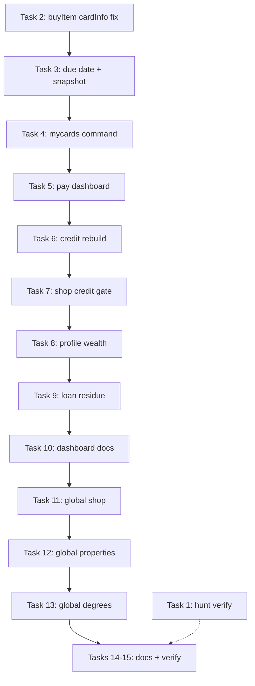

# V2 Economy Completion + My Cards Implementation Plan

> **For agentic workers:** REQUIRED SUB-SKILL: Use superpowers:subagent-driven-development (recommended) or superpowers:executing-plans to implement this plan task-by-task. Steps use checkbox (`- [ ]`) syntax for tracking.

**Goal:** Finish the Fortuna V2 Global Economy Completion Plan by (1) shipping a robust **My Cards** credit experience, (2) removing remaining **loan residue** and fixing **profile debt/net worth**, and (3) migrating **shop / properties / degrees** to global backend-owned catalogs with admin lockdown and doc cleanup.

**Architecture:** Execute in four phases with clear dependencies. **Phase 1 (My Cards)** fixes user-visible credit bugs first — it unblocks `!credit`, wealth display, and shop card purchases. **Phase 2 (Loan residue)** removes dead code paths that still reference removed loan schema. **Phase 3 (Global catalogs)** is the largest migration: seed once by catalog key, stop guild-scoped economy identity. **Phase 4 (Docs + verification)** aligns public site and grep checklist.

**Tech Stack:** TypeScript, Discord.js Components V2, Prisma/MongoDB, Redis, `creditCardService`, `shopService`, `economyConfig.ts`

**Related plans:**
- `docs/superpowers/plans/2026-06-21-credit-card-hunt-items.md` — absorbed into Phase 1 below
- `docs/superpowers/plans/2026-06-21-v2-gaps-remediation.md` — prior work; do not redo completed items

**Canonical economy reference:** `FORTUNA_V2_ECONOMY.md` (update after each phase)

---

## Repo snapshot (re-audited 2026-06-21)

Use this table to avoid redoing finished work or chasing removed code.

| Area | Gap audit said | Actual repo state |
|------|----------------|-------------------|
| `Loan` model in root `prisma/schema.prisma` | Present | **Removed** — no `Loan`, no `User.loans`, no `isLoanBanned` |
| `bankingService.ts` loan APIs | Full stack | **Investment-only** — no `applyForLoan` / `processOverdueLoans` |
| `scheduler.ts` `processOverdueLoans` | Every minute | **Removed** — investments + weekly card settlement only |
| `BANKING_CONFIG` loan tiers | Present | **Removed** from bot `economyConfig.ts` |
| User-facing `!bank loan` | Redirect | **Done** — redirects to Cards |
| `creditCardService.ts` | Partial | **Substantially complete** — issue/pay/statements/settlement/garnishment |
| `!credit` | Redirect stub | **Still stub** — needs card dashboard |
| `!mycards` | Missing | **Missing** |
| Shop card charge UI feedback | Balance “stuck” | **Bug:** `buyItem()` returns `{ item, results }` but **drops `cardInfo`** — purchase may charge DB but confirmation never shows updated balance |
| `profile.ts` loan debt | Subtracts loans | **Stale/broken** — still `include: { loans: true }` but relation no longer exists in schema |
| Per-guild shop/properties/degrees | Per-guild | **Still per-guild** — `shopService`, `propertyService`, `educationService` |
| Admin mutators (`shop-add`, `setdegree`, …) | Active | **Still routed** in `commandRouter.ts` |
| Dashboard docs/schema loans | Stale | **Still stale** in `dashboard/prisma/schema.prisma` and docs pages |
| `index.ts` `loan_` / `repay_` routing | Present | **Still present** (line ~136) |
| `shopItemEffects` `loan_forgiveness_note` | Handler exists | **Still present** — item not in shop catalog |
| Hunt consumables (camouflage/bait/echo) | Unwired | **Wired** in `shopItemEffects.ts` + `huntService.ts` — verify only |
| Stock market guild scope | Out of scope | Unchanged — **explicitly out of scope** |

---

## Phase 1 — My Cards + Credit UX (user priority)

**Why first:** Fixes reported “card balance stuck”, due date visibility, and pay flows without waiting on catalog migration.

### Task 1: Hunt consumables — verify only

**Files:** `src/services/shopItemEffects.ts`, `src/services/huntService.ts`, `src/commands/economy/shop.ts`

- [ ] **Step 1:** Confirm switch cases exist for `echo_whistle`, `bait_box`, `camouflage_kit`.
- [ ] **Step 2:** Confirm `shop.ts` `handleShopUseInteraction` passes `itemKey` (not display name) to `handleSpecialItemUse`.
- [ ] **Step 3:** Run `npx tsc --noEmit`.

---

### Task 2: Fix shop card charge feedback (root cause of “balance stuck”)

**Files:**
- Modify: `src/services/shopService.ts` (~line 305)
- Modify: `src/commands/economy/shop.ts` (`executeBuy`, credit confirm handler)

**Bug:** Transaction sets `cardInfo` but final return omits it:

```typescript
// shopService.ts — current (broken)
return { item: res.item, results };

// required
return { item: res.item, results, cardInfo: res.cardInfo, paymentSource: res.paymentSource };
```

- [ ] **Step 1:** Fix `buyItem()` return shape.
- [ ] **Step 2:** In `executeBuy`, when `paymentSource === "card"`:
  - If not tester and `!cardInfo` → throw (don't silently succeed)
  - Show: balance owed, limit, utilization %, weekly spend used
- [ ] **Step 3:** When `isTester` and card path chosen → show banner: *Tester mode — purchase free; card not charged.*
- [ ] **Step 4:** Extend shop economy log with post-charge `currentBalance`.
- [ ] **Step 5:** Run `npx tsc --noEmit`.

---

### Task 3: Card lifecycle — due date + display snapshot

**Files:**
- Modify: `src/services/creditCardService.ts`
- Modify: `src/commands/economy/bank.ts` (mine view)

- [ ] **Step 1:** In `cardDataFromTier()`, set `dueAt: nextWeek(now)` alongside `nextStatementAt`.
- [ ] **Step 2:** Add exported helper:

```typescript
export function getCardDisplaySnapshot(card: CreditCard) {
  const tier = getCardTierConfig(card.tier);
  const cycleEndsAt = card.dueAt ?? card.nextStatementAt;
  return {
    amountOwedNow: card.currentBalance,
    utilizationPct: card.creditLimit > 0 ? card.currentBalance / card.creditLimit : 0,
    projectedMinimumDue: card.currentBalance > 0 ? calculateMinimumDue(card.currentBalance, tier) : 0,
    cycleEndsAt,
  };
}
```

- [ ] **Step 3:** Refactor **My Cards** mine view labels:
  - **Balance owed:** `currentBalance / creditLimit` (+ utilization %)
  - **Projected minimum due:** from snapshot
  - **Due date:** Discord timestamp (never “No due date yet” on new cards)
  - **Last statement balance:** keep separate field
- [ ] **Step 4:** Run `npx tsc --noEmit`.

---

### Task 4: `!mycards` command + fix `!card` default

**Files:**
- Modify: `src/commands/economy/bank.ts` — export `buildMyCardsPayload()`
- Modify: `src/commands/economy/card.ts`
- Modify: `src/commandRouter.ts` — aliases `mycards`, `my-cards`, `mycard`
- Modify: `src/commands/general/help.ts`

- [ ] **Step 1:** `buildMyCardsPayload(discordId, displayName)` → `buildBankCardsPayload(..., "mine")`.
- [ ] **Step 2:** Router: `mycards` / `my-cards` / `mycard` → reply with mine payload.
- [ ] **Step 3:** `handleCard()` default (`info` / no args):
  - Has card → `"mine"` view
  - No card → `"catalog"` with apply CTA
- [ ] **Step 4:** Update help entries for `card`, `mycards`, `credit`.
- [ ] **Step 5:** Run `npx tsc --noEmit`.

---

### Task 5: My Cards dashboard — transactions, refresh, pay buttons

**Files:**
- Modify: `src/services/creditCardService.ts` — extend `getCardSummary` with OPEN statement
- Modify: `src/commands/economy/bank.ts`
- Modify: `src/handlers/bankInteractionHandler.ts`

**Mine view additions:**

| UI element | Behavior |
|------------|----------|
| Open statement block | If OPEN `CardStatement`: cycle key, balance, paid, min due, due date |
| Recent transactions | Last 5 `CardTransaction` rows (PURCHASE/PAYMENT/WITHDRAW/INTEREST) |
| Refresh button | `bank:cards_my_refresh:{ownerId}` re-fetches mine view |
| Pay Minimum | `bank:card_pay_min:{ownerId}` — OPEN statement min remaining, else projected min |
| Pay Full | `bank:card_pay_full:{ownerId}` — pays `currentBalance` |
| Pay Custom | `bank:card_pay_custom:{ownerId}` → modal `bank:card_pay_modal:{ownerId}` |

- [ ] **Step 1:** Add `getOpenCardStatement(discordId)` or include in `getCardSummary`.
- [ ] **Step 2:** Add `buildCardPayRow()` + `formatCardTransaction()` in `bank.ts`.
- [ ] **Step 3:** Wire pay/refresh/modal handlers in `bankInteractionHandler.ts` using `payCard()`.
- [ ] **Step 4:** Edge cases: `currentBalance <= 0` → disable pay row; DELINQUENT banner; LOCKED still allows pay toward unlock.
- [ ] **Step 5:** Keep `!card pay <amount>` as text fallback.
- [ ] **Step 6:** Run `npx tsc --noEmit`.

---

### Task 6: Rebuild `!credit` as card entry point

**Files:**
- Modify: `src/commands/economy/credit.ts`
- Optional create: `src/commands/economy/cardDashboard.ts` if `credit.ts` ↔ `bank.ts` circular import

- [ ] **Step 1:** Replace text redirect with Components V2:
  - Credit score, eligible tier, card status summary
  - Button row: “Open My Cards” (same payload as `!mycards`)
- [ ] **Step 2:** If circular import → extract shared builders to `cardDashboard.ts`.
- [ ] **Step 3:** Run `npx tsc --noEmit`.

---

### Task 7: Shop — gate “Buy (Credit)” button

**Files:** `src/commands/economy/shop.ts`

- [ ] **Step 1:** Before rendering credit buy button, check user has ACTIVE card (`getCardSummary`).
- [ ] **Step 2:** If no card or status ≠ ACTIVE → hide button or show disabled “Need active card” with link text to `!mycards`.
- [ ] **Step 3:** Run `npx tsc --noEmit`.

---

## Phase 2 — Loan residue cleanup

**Why second:** Unblocks correct wealth/net-worth math and removes broken Prisma includes. Most loan *infrastructure* is already gone; this phase is **residue + profile fix**.

### Task 8: Fix `!profile` wealth — card debt, not loans

**Files:** `src/commands/economy/profile.ts`

- [ ] **Step 1:** Remove `loans: true` from Prisma includes (relation no longer exists).
- [ ] **Step 2:** Replace loan debt line:

```typescript
const cardDebt = cardSummary.card?.currentBalance ?? 0;
const netWorth = walletBal + bankBal + stockValue + invValue - cardDebt;
```

- [ ] **Step 3:** Wealth page copy:
  - **Active Debt:** card `currentBalance` (not loan totalRepayment)
  - Show card tier, status, min due, due date alongside existing card section
- [ ] **Step 4:** Run `npx tsc --noEmit`.

---

### Task 9: Remove loan handlers and routing residue

**Files:**
- Modify: `src/services/shopItemEffects.ts` — remove `loan_forgiveness_note` case + handler
- Modify: `src/index.ts` — remove `loan_` / `repay_` from interaction routing (keep `bank:`)
- Modify: `src/utils/interactionHelpers.ts` — remove loan early-ack if present
- Modify: `src/commands/admin/resetEconomy.ts` — remove `prisma.loan.deleteMany` if still present
- Modify: `src/commands/general/help.ts` — remove “cards and loans” wording

- [ ] **Step 1:** Grep and delete all bot-side loan references:

```powershell
rg -i "loan" src/ --glob "!**/node_modules/**"
```

Expected after cleanup: no `prisma.loan`, no `loans: true`, no `loan_forgiveness`, no `loan_`/`repay_` routes (except historical comments in `FORTUNA_V2_ECONOMY.md`).

- [ ] **Step 2:** Run `npx tsc --noEmit`.

---

### Task 10: Dashboard schema + public docs scrub

**Files:**
- Modify: `dashboard/prisma/schema.prisma` — align with root schema (remove loan fields from any `GuildEconomyConfig`-style models)
- Modify: `dashboard/src/app/docs/page.tsx`
- Modify: `dashboard/src/app/docs/commands/page.tsx`
- Modify: `dashboard/src/app/policy/page.tsx`
- Modify: `dashboard/src/app/commands/admin/page.tsx`
- Modify: `dashboard/src/app/layout.tsx` — remove “Admin Dashboard for Fortuna Bot” if economy admin is retired

- [ ] **Step 1:** Replace loan sections with **Fortuna Cards** (apply, mycards, pay, weekly statement, delinquency).
- [ ] **Step 2:** Remove admin commands for loans, chat-money, per-guild economy config.
- [ ] **Step 3:** Regenerate dashboard Prisma client if schema changed.

---

## Phase 3 — Global backend-owned catalogs

**Why third:** Largest migration; depends on stable credit/profile flows from Phases 1–2.

**Design principle (from V2 plan):** Catalog content lives in code (`shopCatalog.ts`, property defs, `DEGREE_PRICES`). DB rows are **instances keyed globally**, not per-guild economy config. `guildId` on transactions = metadata only.

### Task 11: Global shop catalog

**Files:**
- Modify: `prisma/schema.prisma` — `ShopItem`: change unique key from `[guildId, name]` to global `[catalogKey]` or use sentinel `guildId: "global"`
- Modify: `src/services/shopService.ts` — seed once globally; lookups by catalog key/name without guild filter
- Modify: `src/commands/economy/shop.ts` — seed calls use global key
- Modify: `src/commandRouter.ts` — move `shop-add`, `manage-shop`, `reset-shop`, `remove-item` to `LEGACY_REMOVED_COMMANDS` or dev-only

**Migration steps:**
- [ ] **Step 1:** Add `catalogKey String` to `ShopItem` (or standardize on existing name + category as global unique).
- [ ] **Step 2:** One-time migration script: dedupe per-guild shop rows → single global row per catalog entry.
- [ ] **Step 3:** Update `buyItem`, `getShopItems`, admin seed functions.
- [ ] **Step 4:** Verify all stores (GENERAL, HUNT, JOB, UNI, COCK, COSMETICS) buy flow on second guild without re-seed.
- [ ] **Step 5:** Run `npx tsc --noEmit`.

---

### Task 12: Global properties

**Files:**
- Modify: `prisma/schema.prisma` — `Property`: remove `@@unique([guildId, key])` → `@@unique([key])`
- Modify: `src/services/propertyService.ts` — global seed; `getPropertyByKey(key)`; `buyProperty(discordId, key)`
- Modify: `collectIncome` — filter owned properties without guild filter on property definition
- Modify: `commandRouter.ts` — `manage-property` → legacy/dev-only

- [ ] **Step 1:** Schema + migration dedupe properties by key.
- [ ] **Step 2:** Update buy/collect/list commands.
- [ ] **Step 3:** Run `npx tsc --noEmit`.

---

### Task 13: Global degrees / education

**Files:**
- Modify: `prisma/schema.prisma` — `Degree`: global key unique (drop guild-scoped uniqueness)
- Modify: `src/services/educationService.ts` — `checkAndSeedDegrees()` global; `getDegrees()` without guild filter
- Modify: `src/commands/admin/` degree admin — `setdegree` / `settuition` → legacy or dev-only (tuition from `DEGREE_PRICES` in code)

- [ ] **Step 1:** Seed degrees from `economyConfig.ts` constants only.
- [ ] **Step 2:** Migration dedupe degree rows.
- [ ] **Step 3:** Verify enroll works on any guild without per-guild seed.
- [ ] **Step 4:** Run `npx tsc --noEmit`.

---

## Phase 4 — Docs, help, verification

### Task 14: Update `FORTUNA_V2_ECONOMY.md`

Add/update sections:
- Fortuna Cards (tiers, limits, weekly cycle, min due formula, delinquency, garnishment)
- Commands: `!mycards`, `!card pay`, bank pay dashboard
- Shop card purchase: `shop buy card <item>` + Buy (Credit) button
- Hunt consumables: camouflage, bait box, echo whistle
- Explicit: loans retired; card balance = user debt for net worth
- Global catalogs: shop/properties/degrees are backend-owned

- [ ] **Step 1:** Edit doc to match implemented code.
- [ ] **Step 2:** Cross-check `economyConfig.ts` CARD_TIERS and DEGREE_PRICES.

---

### Task 15: Final verification checklist

- [ ] **Non-tester** shop card purchase increases `currentBalance` and confirmation shows new balance
- [ ] `!mycards` shows due date, projected min due, pay buttons
- [ ] `!credit` opens card-focused dashboard (not text stub)
- [ ] `!profile` wealth uses card debt; no `loans` Prisma include
- [ ] `rg prisma\.loan src/` → no matches
- [ ] `rg "loans: true" src/` → no matches
- [ ] `rg "processOverdueLoans" src/` → no matches
- [ ] Shop/properties/degrees work on second guild without admin seed
- [ ] Hunt consumables activate + consume on next hunt
- [ ] `npx tsc --noEmit` passes
- [ ] Dashboard docs mention cards, not loans

---

## Execution order (recommended)



**Parallelizable:** Task 1 (hunt verify) anytime before final verification.

**Do not start Phase 3 until Phase 2 Task 8 (profile) is done** — wealth math must use card debt before global catalog testing.

---

## Out of scope

- Stock market guild → global migration
- Removing `guildId` from stock transactions
- New Next.js admin dashboard for economy config
- Credit score changes outside weekly card settlement (by design)
- Degree price rebalancing (use existing `DEGREE_PRICES`)

---

## Risk notes

| Risk | Mitigation |
|------|------------|
| `buyItem` cardInfo bug hides real charges | Task 2 — fix return + error if card path fails |
| Profile crashes on `loans: true` | Task 8 — remove include immediately |
| Global catalog migration duplicates items | Dedupe script + unique index on catalog key |
| Circular imports (`credit.ts` ↔ `bank.ts`) | Extract `cardDashboard.ts` |
| Tester false positives on card QA | Banner on free purchases; test with non-tester account |
| Dashboard schema drift from bot | Task 10 aligns both schemas |

---

## Quick command reference (target state)

| Command | Purpose |
|---------|---------|
| `!mycards` | Full card dashboard: balance, due date, min due, transactions, pay buttons |
| `!card pay <amount>` | Text fallback payment |
| `!card issue` / `!bank` → Apply | Get a card |
| `!credit` | Credit score + card summary entry point |
| `!shop` → Buy (Credit) | Charge card (requires ACTIVE card) |
| `!profile` wealth | Net worth subtracts **card balance**, not loans |
